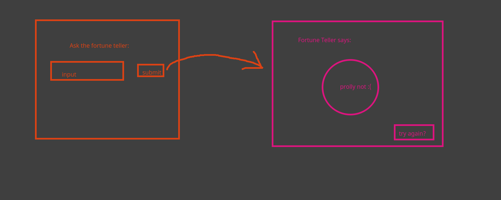

# fortune teller

## Elements

Header

input box
submit button

8ball image
8ball text
try again button

## js

listener on the submit button
triggers changing page to show the response format via css classes
picks a random response

## css

use css hidden property and use js to assign it to elemets when the page is changed
